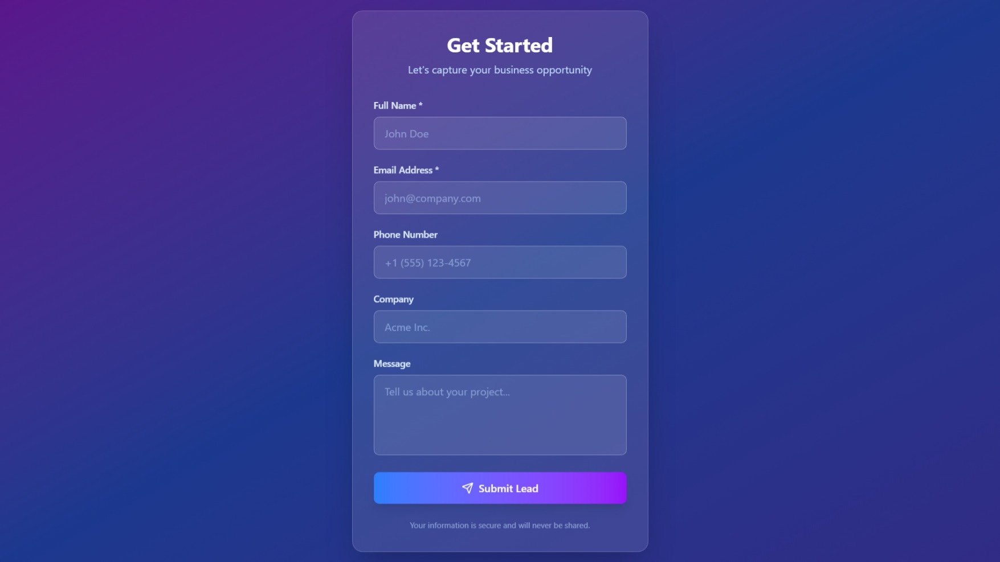
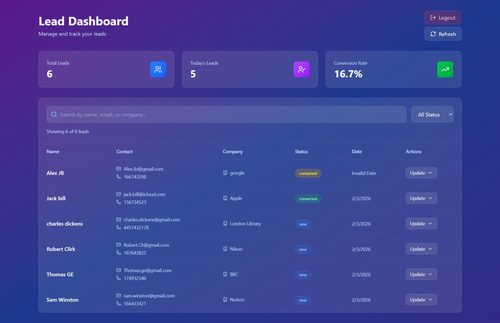

# 🚀 Lead Management System

A full-stack lead capture and management platform with automated follow-ups, built with React, n8n, and Google Sheets.


## 🎯 Overview

This project demonstrates a complete lead management workflow:
- **Public-facing form** for lead capture with validation
- **Automated workflows** for email notifications and data storage
- **Admin dashboard** for lead management with real-time updates
- **Password-protected** interface with authentication

Perfect for freelancers, small businesses, or anyone needing a simple CRM solution.


## Live Demos
[Dashboard](https://lead-capture-19iq.vercel.app/)

[Leads-form](https://lead-capture-pi.vercel.app/)

---

## ✨ Features

### Lead Capture Form
- ✅ Real-time validation (email, phone, required fields)
- ✅ Glassmorphism design with smooth animations
- ✅ Mobile-responsive
- ✅ Success/error state handling
- ✅ Webhook integration with n8n

### Automation (n8n)
- ✅ Automatic email confirmation to leads
- ✅ Internal team notifications
- ✅ Google Sheets integration for data storage
- ✅ Status tracking (new, contacted, converted)

### Admin Dashboard
- ✅ Real-time lead viewing and management
- ✅ Advanced filtering and search
- ✅ Status updates with optimistic UI
- ✅ Analytics (total leads, conversion rate, daily stats)
- ✅ Password protection
- ✅ Auto-refresh and manual refresh options

---

## 🛠️ Tech Stack

**Frontend**
- React 18 + Vite
- TanStack Query (React Query) for data fetching
- Tailwind CSS for styling
- Lucide React for icons

**Automation & Backend**
- n8n (self-hosted workflows)
- Google Sheets (database)
- Resend (email delivery)

**Authentication**
- React Context API
- Session-based auth

---

## 📁 Project Structure
```
lead-management-system/
├── lead-form/              # Public-facing lead capture form
├── dashboard/              # Admin dashboard for lead management
├── n8n-workflows/          # Exportable n8n workflow JSONs
├── docs/                   # Documentation and screenshots
└── README.md               # This file
```

---

## 🚀 Quick Start

### Prerequisites

- Node.js 18+ and npm
- n8n instance (self-hosted or cloud)
- Google account (for Sheets)
- Resend account (free tier)

### 1. Clone the Repository
```bash
git clone https://github.com/yourusername/lead-management-system.git
cd lead-management-system
```

### 2. Set Up Lead Form
```bash
cd lead-form
npm install
npm run dev
```

Open `http://localhost:5173` to see the form.

**Configure webhook URL:**
Edit `src/components/LeadCaptureForm.jsx` line 55 and replace with your n8n URL:
```javascript
const response = await fetch('http://localhost:5678/webhook/lead-capture', {
```

See [lead-form/README.md](./lead-form/README.md) for detailed setup.

### 3. Set Up n8n Workflows

1. Import workflows from `n8n-workflows/` folder
2. Configure credentials (Google Sheets, Resend)
3. Activate workflows

See [n8n-workflows/README.md](./n8n-workflows/README.md) for step-by-step guide.

### 4. Set Up Dashboard
```bash
cd dashboard
npm install
npm run dev
```

**Configure API endpoints and password:**

Edit `src/context/AuthContext.jsx` line 5:
```javascript
const ADMIN_PASSWORD = 'admin123'; // Change this!
```

Edit `src/services/api.js` line 2:
```javascript
const API_BASE_URL = 'http://localhost:5678/webhook';
```

See [dashboard/README.md](./dashboard/README.md) for detailed configuration.

---

## 🎨 Screenshots

### Lead Capture Form

*Glassmorphic design with real-time validation*

### Admin Dashboard

*Real-time lead management with analytics*

---

## 🔧 Configuration

### Lead Form

**File:** `lead-form/src/components/LeadCaptureForm.jsx`

Update webhook URL (around line 55):
```javascript
const response = await fetch('YOUR_N8N_URL/webhook/lead-capture', {
  method: 'POST',
  headers: { 'Content-Type': 'application/json' },
  body: JSON.stringify({ ...formData, timestamp: new Date().toISOString() })
});
```

### Dashboard

**File:** `dashboard/src/context/AuthContext.jsx`

Change admin password (line 5):
```javascript
const ADMIN_PASSWORD = 'your_secure_password'; // Change this!
```

**File:** `dashboard/src/services/api.js`

Update API base URL (line 2):
```javascript
const API_BASE_URL = 'YOUR_N8N_URL/webhook';
```

### n8n Workflows

- Configure Google Sheets credentials
- Set up Resend API key
- Update email templates
- Activate all workflows

---

## 📊 Data Flow
```
┌─────────────┐
│ Lead visits │
│  website    │
└──────┬──────┘
       │
       ▼
┌─────────────────┐
│  Fills form &   │
│   submits       │
└──────┬──────────┘
       │
       ▼
┌─────────────────┐
│  n8n Webhook    │
│   receives data │
└──────┬──────────┘
       │
       ├──────────────────────┬──────────────────────┐
       ▼                      ▼                      ▼
┌──────────────┐    ┌──────────────┐      ┌──────────────┐
│ Send email   │    │ Save to      │      │ Notify team  │
│ to lead      │    │ Google Sheets│      │ via email    │
└──────────────┘    └──────┬───────┘      └──────────────┘
                           │
                           ▼
                    ┌──────────────┐
                    │ Admin views  │
                    │ in Dashboard │
                    └──────────────┘
```

---

## 🚢 Deployment

### Before Deploying

**⚠️ Important: Update these files for production:**

1. **Lead Form** - Update n8n URL in `LeadCaptureForm.jsx`
2. **Dashboard** - Update password in `AuthContext.jsx`
3. **Dashboard** - Update API URL in `api.js`

### Deploy Lead Form

**Vercel:**
```bash
cd lead-form
npm run build
npx vercel --prod
```

**Netlify:**
```bash
cd lead-form
npm run build
npx netlify deploy --prod --dir=dist
```

### Deploy Dashboard

**Vercel:**
```bash
cd dashboard
npm run build
npx vercel --prod
```

**Netlify:**
```bash
cd dashboard
npm run build
npx netlify deploy --prod --dir=dist
```

### Deploy n8n

- **Self-hosted**: Docker or npm installation
- **Cloud**: n8n.cloud (paid)

---

## 🔐 Security Notes

**Current Setup:**
- ✅ Good for demos and portfolio projects
- ✅ Session-based authentication
- ✅ Simple password protection

**For Production, Consider:**
- Use environment variables for sensitive data
- Implement proper authentication (Firebase, Auth0, Supabase)
- Use HTTPS for all endpoints
- Add rate limiting
- Hash passwords securely
- Implement CORS properly

**Quick Security Improvement:**

For production, use environment variables instead of hardcoded values:
```javascript
// Example: Using environment variables (Vite)
const API_URL = import.meta.env.VITE_API_URL || 'http://localhost:5678';
const PASSWORD = import.meta.env.VITE_PASSWORD || 'admin123';
```

---

## 🧪 Testing

### Test Lead Form
1. Fill out the form with valid data
2. Submit and check for success message
3. Verify email received
4. Check Google Sheets for new entry

### Test Dashboard
1. Visit dashboard and login
2. Verify leads display from Google Sheets
3. Test search functionality
4. Test status filter
5. Update a lead status
6. Refresh and verify changes persist

### Test n8n Workflows
```bash
# Test lead capture
curl -X POST http://localhost:5678/webhook/lead-capture \
  -H "Content-Type: application/json" \
  -d '{"name":"Test","email":"test@example.com","phone":"1234567890"}'

# Test get leads
curl http://localhost:5678/webhook/get-leads

# Test update status
curl -X POST http://localhost:5678/webhook/update-lead-status \
  -H "Content-Type: application/json" \
  -d '{"email":"test@example.com","status":"contacted"}'
```

---

## 🤝 Contributing

Contributions are welcome! Please feel free to submit a Pull Request.

1. Fork the project
2. Create your feature branch (`git checkout -b feature/AmazingFeature`)
3. Commit your changes (`git commit -m 'Add some AmazingFeature'`)
4. Push to the branch (`git push origin feature/AmazingFeature`)
5. Open a Pull Request

---

## 📝 License

This project is licensed under the MIT License - see the [LICENSE](LICENSE) file for details.

---

## 👤 Author

**Your Name**
- LinkedIn: [Your LinkedIn](https://www.linkedin.com/in/ubba-obada)
- GitHub: [@Ubba](https://github.com/Obada-barakat)
- Portfolio: [Ubba | portfolio](https://ubba-portfolio.vercel.app/)

---

## 🙏 Acknowledgments

- [React](https://react.dev/)
- [TanStack Query](https://tanstack.com/query)
- [n8n](https://n8n.io/)
- [Tailwind CSS](https://tailwindcss.com/)
- [Lucide Icons](https://lucide.dev/)
- [Resend](https://resend.com/)

---

## 📧 Support

If you have any questions or need help:
- Open an issue on GitHub
- Contact me on LinkedIn
- Email: obada.baracat1@gmail.com

---

**⭐ If you found this project helpful, please give it a star!**
